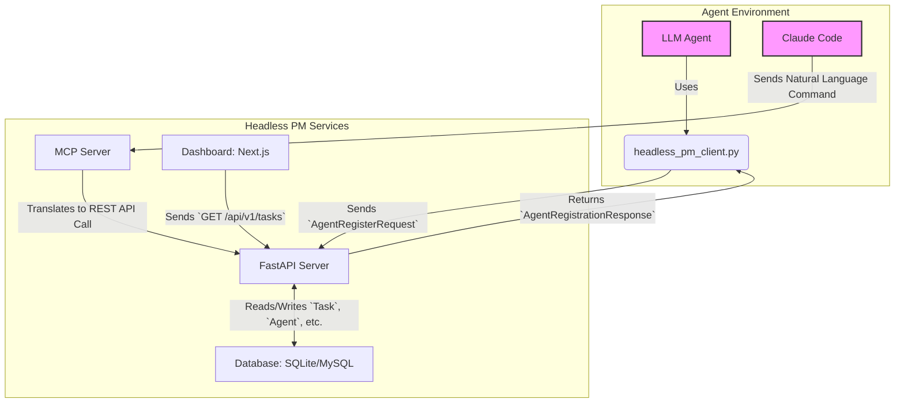
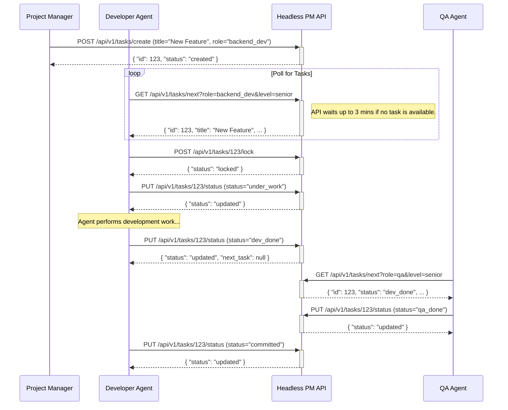
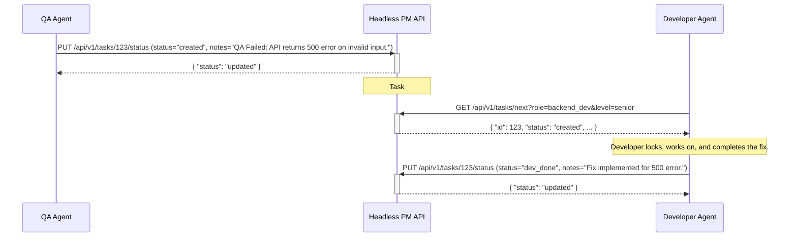

# Headless PM: A Developer's Guide to Design, Roles, and Integration

## 1. Overview

Headless PM is a comprehensive REST API and toolkit designed for the coordination of Large Language Model (LLM) agents within software development projects. Its core purpose is to provide a structured environment for autonomous or semi-autonomous agents to collaborate on complex tasks.

This document provides an in-depth guide for developers and architects. It systematically describes the system's design, its interfaces, and the practical steps required to integrate with or extend it.

### 1.1. Core Concepts & Design Rationale

-   **Task Hierarchy**: Work is organized as **Epics → Features → Tasks**. 
    *   **Why?** This provides a clear, structured way to break down complex projects into manageable work units for agents, mirroring human project management methodologies.
-   **Document-Based Communication**: Agents communicate by creating shared documents with `@mention` support.
    *   **Why?** This creates an immutable, auditable log of all agent decisions and interactions, which is critical for debugging and traceability in complex autonomous systems.
-   **Role-Based Specialization**: Agents assume specific roles (`frontend_dev`, `backend_dev`, `qa`, etc.).
    *   **Why?** This allows for the development of specialized agents that are highly effective at specific parts of the development lifecycle, promoting efficiency and expertise.
-   **Git-Integrated Workflow**: Task complexity (`MAJOR` vs. `MINOR`) dictates the Git workflow (PR vs. direct commit).
    *   **Why?** This automates development best practices, ensuring that significant changes undergo a review process while minor fixes can be implemented quickly.
-   **Server-Driven Velocity**: The API is designed to push agents forward by providing the next available task upon completion of the current one.
    *   **Why?** This is a crucial design choice for enabling high-speed autonomous operation. It minimizes the need for agents to poll for work and reduces idle time, making the entire system more efficient.

## 2. System Architecture & Data Flow

Headless PM is a multi-component system designed for flexibility and separation of concerns.



-   **FastAPI Server**: The core of the system, providing a RESTful API for all operations.
-   **Database**: Uses `SQLModel` for ORM, supporting both SQLite and MySQL.
-   **Python Client (`headless_pm_client.py`)**: The primary tool for custom agent integration via the REST API.
-   **MCP Server**: An abstraction layer for natural language interaction with clients like Claude Code.
-   **Dashboard**: A Next.js application for real-time project visualization.

## 3. Core Mechanics: The "How" Behind the System

This section details the underlying logic of key system behaviors that are critical for integration.

### 3.1. Task Assignment Logic

The system assigns tasks based on a clear priority queue and skill-based filtering, as implemented in `src/services/task_service.py`.

1.  **Priority**: The system prioritizes the **oldest available task** first (`order_by(Task.created_at)`). This ensures that work is addressed in the order it was created.
2.  **Role Matching**: Tasks are assigned based on the `target_role` of the task matching the agent's `role`.
    *   **QA Agents**: Specifically look for tasks in `TaskStatus.DEV_DONE`.
    *   **Other Roles (Developers, PMs, Architects)**: Look for tasks in `TaskStatus.CREATED` or `TaskStatus.APPROVED` (for backward compatibility).
3.  **Skill-Based Filtering**: An agent can take any task at or below its `level`. For example, a `SENIOR` developer can take `SENIOR` or `JUNIOR` tasks. This allows experienced agents to pick up lower-level work when no other tasks are available.
    *   The `get_next_task_for_agent` function dynamically determines `allowed_difficulties`. It considers the agent's own `level` and also checks for active agents (seen in the last 30 minutes) at lower skill levels. If there are no active agents at a lower skill level for a given role, a higher-level agent can pick up tasks from that lower difficulty. This ensures that tasks don't get stuck if junior agents are unavailable.

### 3.2. Stale Lock Cleanup

To prevent tasks from being permanently stuck, the system has a crucial, non-obvious mechanism: **stale lock cleanup**. This is handled by the `cleanup_stale_locks` function in `src/services/task_service.py`.

-   **How it Works**: At the beginning of *every* call to `get_next_task_for_agent`, the system checks for tasks that have been locked for more than 30 minutes by an agent that has not been seen in that same time frame. If such a task is found, its `locked_by_id` is set to `null`, making it available for other agents to pick up.
-   **Implication for Developers**: This is a self-healing mechanism. If an agent crashes or goes offline, its locked tasks will automatically re-enter the queue after a 30-minute timeout, ensuring the project does not stall.

### 3.3. The Server-Driven Workflow

The API is designed to facilitate a high-velocity, autonomous workflow. The key to this is the response object for the `PUT /tasks/{task_id}/status` endpoint, `TaskStatusUpdateResponse`.

When an agent updates a task's status, the API doesn't just confirm the update; it tells the agent what to do next.

-   `task`: The task that was just updated.
-   `next_task`: If another task is immediately available for the agent, it is provided here. This allows the agent to move directly to the next work item without a separate API call.
-   `workflow_status`: A string (`continue`, `waiting`, or `no_tasks`) that signals the agent's next state.
-   `continuation_prompt`: A natural language instruction for the agent, like "Continue with the next task without waiting for confirmation."

This design minimizes the number of API calls an agent needs to make and embeds the workflow logic into the API's responses, making it easier to build powerful, autonomous agents.

**Example `TaskStatusUpdateResponse` Payload:**

```json
{
  "task": {
    "id": 123,
    "feature_id": 1,
    "title": "Implement User Login",
    "description": "Develop the backend API for user authentication.",
    "created_by": "pm_agent_001",
    "target_role": "backend_dev",
    "difficulty": "senior",
    "complexity": "major",
    "branch": "feature/user-login",
    "status": "dev_done",
    "locked_by": null,
    "locked_at": null,
    "notes": "Implementation complete, ready for QA.",
    "created_at": "2024-01-01T10:00:00",
    "updated_at": "2024-01-01T15:30:00",
    "task_type": "regular",
    "poll_interval": null
  },
  "next_task": {
    "id": 124,
    "feature_id": 1,
    "title": "Write Unit Tests for Login API",
    "description": "Create comprehensive unit tests for the user login API endpoints.",
    "created_by": "pm_agent_001",
    "target_role": "backend_dev",
    "difficulty": "junior",
    "complexity": "minor",
    "branch": "feature/user-login-tests",
    "status": "created",
    "locked_by": null,
    "locked_at": null,
    "notes": null,
    "created_at": "2024-01-01T16:00:00",
    "updated_at": "2024-01-01T16:00:00",
    "task_type": "regular",
    "poll_interval": null
  },
  "workflow_status": "continue",
  "task_completed": 123,
  "auto_continue": true,
  "continuation_prompt": "Continue with the next task without waiting for confirmation",
  "session_momentum": "high"
}
```

## 4. Task Lifecycle: A Narrative Timeline

The journey of a task from creation to completion is the central workflow of Headless PM.

### 4.1. The Happy Path



### 4.2. QA Failure and Rework Loop

When a QA agent finds a bug, the task is sent back to the `CREATED` state for a developer to pick up again.



## 5. Interfaces for Integration

Headless PM offers two primary interfaces for integration, catering to different needs.

### 5.1. The Core REST API

This is the fundamental, programmatic interface to the system. It is the recommended integration point for custom-built agents.

-   **How it Works**: Standard HTTP requests are made to endpoints defined in `src/api/`. The `headless_pm_client.py` provides a clear, synchronous Python implementation of how to interact with these endpoints.
-   **Strengths**:
    -   **Full Control**: Direct access to all system features.
    -   **Language Agnostic**: Can be used by an agent written in any language.
    -   **Efficient**: No abstraction layer means lower overhead.
-   **Limitations**: Requires the agent developer to handle the logic of the HTTP requests, responses, and the overall workflow.
-   **Primary Use Case**: Building custom, automated agents that need fine-grained control over the system.

### 5.2. The MCP Interface

This is an abstraction layer designed for LLM-native clients that operate via natural language.

-   **How it Works**: The MCP server, defined in `src/mcp/server.py`, exposes a set of "tools" (e.g., `register_agent`, `get_next_task`). An MCP-compatible client, like Claude Code, translates a user's natural language command into a call to one of these tools. The MCP server then translates this tool call into one or more calls to the core REST API.
-   **Strengths**:
    -   **Natural Language Interaction**: Allows for human-in-the-loop or LLM-driven control without writing code.
    -   **Simplified Interface**: Abstracts away the complexities of the REST API.
-   **Limitations**:
    -   **Less Control**: Only exposes the functionality defined by the MCP tools.
    -   **Higher Overhead**: Adds an extra layer of translation.
    -   As noted in `agents/README.md`, "Claude Code does not work well in agentic mode using MCP. It should be directed to use headless_pm_client.py instead." This suggests the MCP interface is best for interactive, human-driven sessions rather than fully autonomous loops.
-   **Primary Use Case**: Interactive sessions with a human developer using an MCP-compatible client like Claude Code.

## 6. Developer Guide: API Reference and Extension

### 6.1. Core REST API Reference

**Base URL**: `http://localhost:6969/api/v1`
**Authentication**: All endpoints require an `X-API-Key` header.

--- 

**Register Agent**

-   **Endpoint**: `POST /register`
-   **Description**: Registers a new agent or updates the `last_seen` timestamp of an existing one. Crucially, the response includes the next available task and any unread mentions, bootstrapping the agent's work loop.
-   **Request Body** (`AgentRegisterRequest`):
    ```json
    {
      "agent_id": "my_agent_001",
      "role": "backend_dev",
      "level": "senior",
      "connection_type": "client"
    }
    ```
-   **Response Body** (`AgentRegistrationResponse`):
    ```json
    {
      "agent": {
        "id": 1,
        "agent_id": "my_agent_001",
        "role": "backend_dev",
        "level": "senior",
        "connection_type": "client",
        "last_seen": "2024-01-01T12:00:00"
      },
      "next_task": {
        "id": 123,
        "feature_id": 1,
        "title": "Implement User Login",
        "description": "Develop the backend API for user authentication.",
        "created_by": "pm_agent_001",
        "target_role": "backend_dev",
        "difficulty": "senior",
        "complexity": "major",
        "branch": "feature/user-login",
        "status": "created",
        "locked_by": null,
        "locked_at": null,
        "notes": null,
        "created_at": "2024-01-01T10:00:00",
        "updated_at": "2024-01-01T10:00:00",
        "task_type": "regular",
        "poll_interval": null
      },
      "mentions": [
        {
          "id": 1,
          "document_id": 101,
          "task_id": null,
          "mentioned_agent_id": "my_agent_001",
          "created_by": "pm_agent_001",
          "is_read": false,
          "created_at": "2024-01-01T11:00:00",
          "document_title": "New Task Assignment"
        }
      ]
    }
    ```

--- 

**Get Next Task**

-   **Endpoint**: `GET /tasks/next`
-   **Description**: Retrieves the next available task for an agent based on its role and skill level. This endpoint will hold the connection open for up to 3 minutes, waiting for a task to become available.
-   **Query Parameters**:
    -   `role` (required): e.g., `backend_dev`
    -   `level` (required): e.g., `senior`
    -   `simulate` (optional): `true` to return immediately without waiting (for testing).
    -   `timeout` (optional): Override wait duration in seconds (default: 180).
-   **Response Body** (`TaskResponse` or `null`)
    ```json
    {
      "id": 123,
      "feature_id": 1,
      "title": "Implement User Login",
      "description": "Develop the backend API for user authentication.",
      "created_by": "pm_agent_001",
      "target_role": "backend_dev",
      "difficulty": "senior",
      "complexity": "major",
      "branch": "feature/user-login",
      "status": "created",
      "locked_by": null,
      "locked_at": null,
      "notes": null,
      "created_at": "2024-01-01T10:00:00",
      "updated_at": "2024-01-01T10:00:00",
      "task_type": "regular",
      "poll_interval": null
    }
    ```

--- 

**Lock a Task**

-   **Endpoint**: `POST /tasks/{task_id}/lock`
-   **Description**: Locks a task to the specified agent, preventing others from working on it. Returns the updated task object.
-   **Path Parameters**:
    -   `task_id` (integer): The ID of the task to lock.
-   **Query Parameters**:
    -   `agent_id` (required): The ID of the agent locking the task.
-   **Response Body** (`TaskResponse`)
    ```json
    {
      "id": 123,
      "feature_id": 1,
      "title": "Implement User Login",
      "description": "Develop the backend API for user authentication.",
      "created_by": "pm_agent_001",
      "target_role": "backend_dev",
      "difficulty": "senior",
      "complexity": "major",
      "branch": "feature/user-login",
      "status": "created",
      "locked_by": "my_agent_001",
      "locked_at": "2024-01-01T12:05:00",
      "notes": null,
      "created_at": "2024-01-01T10:00:00",
      "updated_at": "2024-01-01T12:05:00",
      "task_type": "regular",
      "poll_interval": null
    }
    ```

--- 

**Update Task Status**

-   **Endpoint**: `PUT /tasks/{task_id}/status`
-   **Description**: Updates a task's status. This is the primary engine of the agent workflow. On success, the lock is released (if moving from `UNDER_WORK`), a changelog is recorded, and the next available task is returned to the agent.
-   **Path Parameters**:
    -   `task_id` (integer): The ID of the task to update.
-   **Query Parameters**:
    -   `agent_id` (required): The ID of the agent performing the update.
-   **Request Body** (`TaskStatusUpdateRequest`):
    ```json
    {
      "status": "dev_done",
      "notes": "Implementation complete, ready for QA."
    }
    ```
-   **Response Body** (`TaskStatusUpdateResponse`):
    ```json
    {
        "task": {
            "id": 123,
            "feature_id": 1,
            "title": "Implement User Login",
            "description": "Develop the backend API for user authentication.",
            "created_by": "pm_agent_001",
            "target_role": "backend_dev",
            "difficulty": "senior",
            "complexity": "major",
            "branch": "feature/user-login",
            "status": "dev_done",
            "locked_by": null,
            "locked_at": null,
            "notes": "Implementation complete, ready for QA.",
            "created_at": "2024-01-01T10:00:00",
            "updated_at": "2024-01-01T15:30:00",
            "task_type": "regular",
            "poll_interval": null
        },
        "next_task": {
            "id": 124,
            "feature_id": 1,
            "title": "Write Unit Tests for Login API",
            "description": "Create comprehensive unit tests for the user login API endpoints.",
            "created_by": "pm_agent_001",
            "target_role": "backend_dev",
            "difficulty": "junior",
            "complexity": "minor",
            "branch": "feature/user-login-tests",
            "status": "created",
            "locked_by": null,
            "locked_at": null,
            "notes": null,
            "created_at": "2024-01-01T16:00:00",
            "updated_at": "2024-01-01T16:00:00",
            "task_type": "regular",
            "poll_interval": null
        },
        "workflow_status": "continue",
        "task_completed": 123,
        "auto_continue": true,
        "continuation_prompt": "Continue with the next task without waiting for confirmation",
        "session_momentum": "high"
    }
    ```

--- 

**Create a Document**

-   **Endpoint**: `POST /documents`
-   **Description**: Creates a document for communication. The `content` is scanned for `@mentions`.
-   **Query Parameters**:
    -   `author_id` (required): The ID of the agent creating the document.
-   **Request Body** (`DocumentCreateRequest`):
    ```json
    {
      "doc_type": "update",
      "title": "API Implementation Complete",
      "content": "The user endpoint is ready. @qa_senior_001 please test."
    }
    ```
-   **Response Body** (`DocumentResponse`):
    ```json
    {
      "id": 101,
      "doc_type": "update",
      "author_id": "my_agent_001",
      "title": "API Implementation Complete",
      "content": "The user endpoint is ready. @qa_senior_001 please test.",
      "meta_data": null,
      "created_at": "2024-01-01T14:00:00",
      "updated_at": "2024-01-01T14:00:00",
      "expires_at": null,
      "mentions": ["qa_senior_001"]
    }
    ```

### 5.3. The MCP Interface: A Closer Look

The Model Context Protocol (MCP) server provides a natural language interface to the API. It works by translating natural language commands into specific tool calls, which then map to the REST API endpoints.

**Example Flow: `get_next_task`**

1.  **User/Agent Input (Natural Language)**: `"Show me the next task"`
2.  **MCP Client (e.g., Claude Code)**: Recognizes the intent and formulates a tool call.
    ```json
    { "method": "tools/call", "params": { "name": "get_next_task" } }
    ```
3.  **MCP Server (`src/mcp/server.py`)**: The `handle_call_tool` function receives this request and routes it to the `_get_next_task` method.
4.  **REST API Call**: The `_get_next_task` method makes a `GET` request to the `/api/v1/tasks/next` endpoint of the core FastAPI server.
5.  **Response**: The JSON response from the REST API is formatted into a `TextContent` object and sent back to the MCP client.

This abstraction simplifies interaction for LLM-native clients but offers less direct control than the REST API.

#### MCP Tool Reference

| Tool Name              | Description                                                  | Input Schema (Key Properties)                               | Example Usage (Natural Language)                                                                                             |
| ---------------------- | ------------------------------------------------------------ | ----------------------------------------------------------- | ---------------------------------------------------------------------------------------------------------------------------- |
| `register_agent`       | Register agent with Headless PM system.                      | `agent_id`, `role`, `skill_level`                           | "Please register me as agent 'claude_mcp_001' with role 'backend_dev' and skill level 'senior'"                               |
| `get_project_context`  | Get project configuration and context information.           | (None)                                                      | "What's the current project context?"                                                                                        |
| `get_next_task`        | Get next available task for the registered agent.            | `role` (optional), `skill_level` (optional)                 | "Get my next available task"                                                                                                 |
| `create_task`          | Create a new task.                                           | `title`, `description`, `complexity`, `role`, `skill_level` | "Create a task titled 'Add user search' for the backend_dev role. The description should be: Implement search with filters." |
| `lock_task`            | Lock a task to prevent other agents from picking it up.      | `task_id`                                                   | "Lock task 123"                                                                                                              |
| `update_task_status`   | Update task status and progress.                             | `task_id`, `status`, `notes` (optional)                     | "Update task 123 status to 'under_work' with notes 'Starting implementation'"                                                |
| `create_document`      | Create a document with optional @mentions.                   | `title`, `content`, `doc_type`, `mentions` (optional)       | "Create a document titled 'API Implementation Complete' with content describing the new user endpoint, mentioning architect_001" |
| `get_mentions`         | Get notifications and mentions for the registered agent.     | (None)                                                      | "Do I have any new mentions or notifications?"                                                                               |
| `register_service`     | Register a microservice with the system.                     | `service_name`, `service_url`, `health_check_url`           | "Register service 'payment_api' at 'http://localhost:8002' with health check at '/health'"                                   |
| `send_heartbeat`       | Send heartbeat for a registered service.                     | `service_name`, `status`                                    | "Send heartbeat for service 'payment_api'"                                                                                   |
| `poll_changes`         | Poll for system changes since a given timestamp.             | `since_timestamp` (optional)                                | "Check for any system changes since my last update."                                                                         |
| `get_token_usage`      | Get MCP token usage statistics.                              | (None)                                                      | "Show me my token usage for this session."                                                                                   |

### 5.4. Practical Extension Guide

The system is designed to be extensible. Here are common extension points with code examples.

**Adding a New Agent Role (e.g., `DevOps`)**

1.  **Update `src/models/enums.py`**: Add the new role to the `AgentRole` enum.
    ```python
    # Before
    class AgentRole(str, Enum):
        FRONTEND_DEV = "frontend_dev"
        # ...

    # After
    class AgentRole(str, Enum):
        FRONTEND_DEV = "frontend_dev"
        # ...
        DEVOPS = "devops"
    ```
2.  **Update `src/api/schemas.py`**: Add the new role to any relevant request schemas to make it available through the API.
    ```python
    # In AgentRegisterRequest and TaskCreateRequest
    role: AgentRole = Field(..., description="Agent's role in the project")
    # No change needed here as it directly uses the enum
    ```
3.  **Define Responsibilities**: Create a new markdown file `agents/client/team_roles/devops.md`.

**Adding a New Task Status (e.g., `DEPLOYING`)**

1.  **Update `src/models/enums.py`**: Add the new status to the `TaskStatus` enum.
    ```python
    # Before
    class TaskStatus(str, Enum):
        # ...
        COMMITTED = "committed"

    # After
    class TaskStatus(str, Enum):
        # ...
        COMMITTED = "committed"
        DEPLOYING = "deploying"
    ```
2.  **Update `src/api/schemas.py`**: Add the new status to the `TaskStatusUpdateRequest` enum if it's explicitly listed (in this case, it uses the `TaskStatus` enum directly, so no change is needed).
3.  **Update Agent Logic**: Instruct agents on when to use the `DEPLOYING` status.

## 6. Strengths and Limitations

### Strengths

-   **Decoupled Architecture**: The stateless nature of the agents and the centralized API allow for a highly decoupled and scalable system.
-   **Auditable Communication**: Document-based communication provides a persistent and reviewable history of all agent interactions.
-   **Flexible Workflow**: The combination of task complexity (Major/Minor) and status flow supports both simple bug fixes and complex feature development.
-   **Server-Driven Agent Velocity**: The API design, particularly the `get_next_task` and `TaskStatusUpdateResponse` objects, enables agents to maintain a continuous workflow with minimal polling, a crucial feature for autonomous operation.

### Limitations

-   **No Real-time Guarantees**: The system is primarily polling-based. While the `get_next_task` endpoint has a long-poll mechanism, there is no WebSocket for real-time, push-based notifications.
-   **Agent Logic is External**: Headless PM is a coordination system; it does not provide any logic for how an agent should actually *perform* a task. This must be implemented by the agent developer.
-   **Potential for Bottlenecks**: In a purely autonomous setup, a lack of available QA agents could cause a bottleneck at the `DEV_DONE` stage, as tasks would pile up waiting for review.

## 7. Conclusion

Headless PM provides a robust and flexible foundation for building sophisticated multi-agent systems for software development. Its design, centered around clear roles, a structured task hierarchy, and auditable document-based communication, creates a scalable environment for agent collaboration. By understanding its core concepts, architectural strengths, and integration interfaces, developers can effectively build, deploy, and extend multi-agent systems to tackle complex software engineering challenges.
