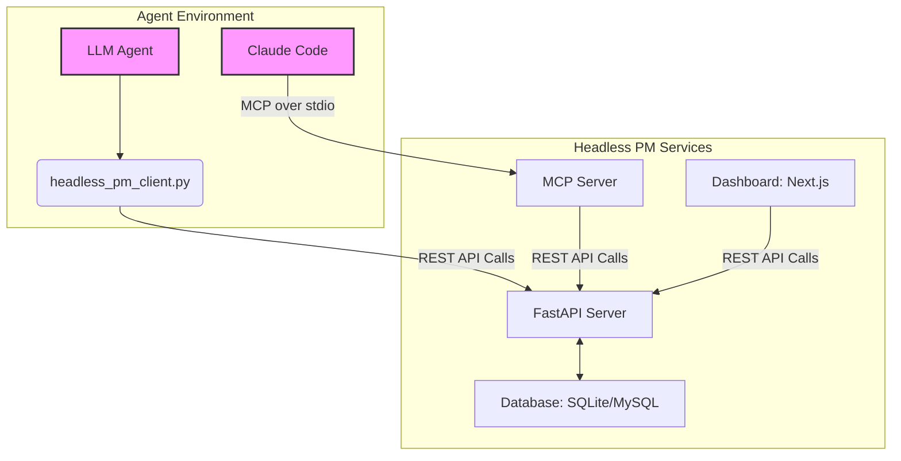

# Headless PM: A Developer's Guide to Design, Roles, and Integration

## 1. Overview

Headless PM is a comprehensive REST API and toolkit designed for the coordination of Large Language Model (LLM) agents within software development projects. Its core purpose is to provide a structured environment for autonomous or semi-autonomous agents to collaborate on complex tasks.

This document provides an in-depth guide for developers and architects. It systematically describes the system's design, its interfaces, and the practical steps required to integrate with or extend it.

### Core Concepts

-   **Task Hierarchy**: Work is organized as **Epics → Features → Tasks**, allowing for clear project breakdown.
-   **Document-Based Communication**: Agents communicate by creating shared documents with `@mention` support, ensuring an auditable trail of interactions.
-   **Role-Based Specialization**: Agents assume specific roles (`frontend_dev`, `backend_dev`, `qa`, etc.) to manage different parts of the development lifecycle.
-   **Git-Integrated Workflow**: Task complexity (`MAJOR` vs. `MINOR`) dictates the Git workflow (PR vs. direct commit), automating best practices.
-   **Server-Driven Velocity**: The API is designed to push agents forward by providing the next available task upon completion of the current one, enabling high-speed autonomous operation.

## 2. System Architecture & Data Flow

Headless PM is a multi-component system designed for flexibility and separation of concerns.



-   **FastAPI Server**: The core of the system, providing a RESTful API for all operations.
-   **Database**: Uses `SQLModel` for ORM, supporting both SQLite and MySQL.
-   **Python Client (`headless_pm_client.py`)**: The primary tool for custom agent integration via the REST API.
-   **MCP Server**: An abstraction layer for natural language interaction with clients like Claude Code.
-   **Dashboard**: A Next.js application for real-time project visualization.

## 3. Database Schema

The data models, defined in `src/models/models.py`, form the backbone of the system.

-   **`Agent`**: Represents a worker in the system. Stores `agent_id`, `role`, `level`, and `last_seen`.
-   **`Epic`, `Feature`, `Task`**: Form the core work hierarchy.
    -   `Epic` is the top-level container.
    -   `Feature` belongs to an `Epic`.
    -   `Task` belongs to a `Feature` and contains the most granular details, including `title`, `description`, `target_role`, `difficulty`, `complexity`, `status`, and `branch`.
-   **`Document`**: The medium for agent communication. Stores `doc_type`, `author_id`, `title`, and `content`.
-   **`Mention`**: Links a `Document` or `Task` to a mentioned `Agent`, enabling notifications.
-   **`Service`**: Used by the service registry to track agent-managed microservices, their status, and health check URLs.
-   **`Changelog`**: Records every status change for a `Task`, providing a complete audit trail.

## 4. Agent Roles and Responsibilities

The system's effectiveness relies on agents adhering to specific roles, as defined in the `AgentRole` enum in `src/models/enums.py`. The `agents/client/team_roles/` directory contains detailed instructions for each.

-   **Architect**: "You are a system architect responsible for: System design and technical specifications, Creating technical tasks for the team, Reviewing major technical decisions, Ensuring code quality and architectural standards, Planning epics and features."
-   **Project Manager (PM)**: "You are a project manager responsible for: Creating and prioritizing tasks, Coordinating team efforts, Removing blockers, Tracking sprint progress, Communicating with stakeholders, Ensuring quality and timely delivery."
-   **Frontend Developer**: "You are a frontend developer responsible for: Implementing UI components and layouts, User interactions and form validation, Backend API integration, Responsive design and accessibility, Frontend testing (unit, integration, e2e), Performance optimization."
-   **Backend Developer**: "You are a backend developer responsible for: Implementing REST/GraphQL APIs, Database design and management, Authentication and authorization, Business logic and data processing, Backend testing and documentation, System performance and scalability."
-   **QA Engineer**: "You are a QA engineer responsible for: Testing features when marked as dev_done, Writing and executing test plans, Reporting bugs and issues, Verifying fixes, Ensuring quality standards, Creating test documentation."

## 5. Developer Guide: Integration & Extension

This section provides the actionable details required to build on and integrate with Headless PM.

### 5.1. Getting Started: The Agent Workflow

An agent's lifeblood is its main loop. The following conceptual workflow, based on `headless_pm_client.py`, is the standard pattern for interacting with the system.

1.  **Register**: The agent first registers itself with the API to get its configuration and its first task.
2.  **Lock & Work**: If a task is available, the agent locks it to prevent others from taking it, and then begins its work (e.g., modifying code).
3.  **Update & Continue**: Upon completing the work, the agent updates the task's status. The API response to this update will contain the *next* available task, enabling a continuous work loop.
4.  **Poll if Idle**: If no task is available, the agent calls the `GET /tasks/next` endpoint, which will wait up to 3 minutes for a new task to appear before returning, thus avoiding inefficient, rapid polling.

```python
# A conceptual agent workflow based on headless_pm_client.py
from headless_pm_client import HeadlessPMClient, TaskStatus

# 1. Register the agent to get its info and first task
client = HeadlessPMClient(agent_id="my_agent_001", role="backend_dev", skill_level="senior")
registration_info = client.register_agent(
    agent_id=client.agent_id, 
    role=client.role, 
    level=client.skill_level
)

current_task = registration_info.get("next_task")

while True:
    if current_task:
        # 2. Lock the task before starting
        client.lock_task(task_id=current_task['id'], agent_id=client.agent_id)
        client.update_task_status(
            task_id=current_task['id'], 
            status=TaskStatus.UNDER_WORK, 
            agent_id=client.agent_id,
            notes="Starting work."
        )

        # 3. Perform the work (e.g., modify code, run tests)
        # ... your agent's logic here ...

        # 4. Update status and get the next task
        update_response = client.update_task_status(
            task_id=current_task['id'], 
            status=TaskStatus.DEV_DONE, 
            agent_id=client.agent_id,
            notes="Work complete, ready for QA."
        )
        
        # The API conveniently returns the next task
        current_task = update_response.get("next_task")
    else:
        # If no task, poll for a new one. The API will wait.
        print("No tasks available. Waiting for next task...")
        current_task = client.get_next_task(role=client.role, level=client.skill_level)
```

### 5.2. Core REST API Reference

For programmatic integration, the REST API is the primary interface. The following are the most critical endpoints for an agent's workflow, derived from `src/api/routes.py` and `src/api/schemas.py`.

**Base URL**: `http://localhost:6969/api/v1`
**Authentication**: All endpoints require an `X-API-Key` header.

--- 

**Register Agent**

-   **Endpoint**: `POST /register`
-   **Description**: Registers a new agent or updates the `last_seen` timestamp of an existing one. Crucially, the response includes the next available task and any unread mentions, bootstrapping the agent's work loop.
-   **Request Body** (`AgentRegisterRequest`):
    ```json
    {
      "agent_id": "my_agent_001",
      "role": "backend_dev",
      "level": "senior",
      "connection_type": "client"
    }
    ```
-   **Response Body** (`AgentRegistrationResponse`):
    ```json
    {
      "agent": { ... },
      "next_task": { ... },
      "mentions": [ ... ]
    }
    ```

--- 

**Get Next Task**

-   **Endpoint**: `GET /tasks/next`
-   **Description**: Retrieves the next available task for an agent based on its role and skill level. This endpoint will hold the connection open for up to 3 minutes, waiting for a task to become available.
-   **Query Parameters**:
    -   `role` (required): e.g., `backend_dev`
    -   `level` (required): e.g., `senior`
-   **Response Body** (`TaskResponse` or `null`)

--- 

**Lock a Task**

-   **Endpoint**: `POST /tasks/{task_id}/lock`
-   **Description**: Locks a task to the specified agent, preventing others from working on it.
-   **Query Parameters**:
    -   `agent_id` (required): The ID of the agent locking the task.
-   **Response Body** (`TaskResponse`)

--- 

**Update Task Status**

-   **Endpoint**: `PUT /tasks/{task_id}/status`
-   **Description**: Updates a task's status. This is the primary engine of the agent workflow. On success, the lock is released, a changelog is recorded, and the next available task is returned to the agent.
-   **Query Parameters**:
    -   `agent_id` (required): The ID of the agent performing the update.
-   **Request Body** (`TaskStatusUpdateRequest`):
    ```json
    {
      "status": "dev_done",
      "notes": "Implementation complete, ready for QA."
    }
    ```
-   **Response Body** (`TaskStatusUpdateResponse`):
    ```json
    {
        "task": { ... },
        "next_task": { ... },
        "workflow_status": "continue"
    }
    ```

--- 

**Create a Document**

-   **Endpoint**: `POST /documents`
-   **Description**: Creates a document for communication. The `content` is scanned for `@mentions`.
-   **Query Parameters**:
    -   `author_id` (required): The ID of the agent creating the document.
-   **Request Body** (`DocumentCreateRequest`):
    ```json
    {
      "doc_type": "update",
      "title": "API Implementation Complete",
      "content": "The user endpoint is ready. @qa_senior_001 please test."
    }
    ```
-   **Response Body** (`DocumentResponse`)

### 5.3. The MCP Interface: A Closer Look

The Model Context Protocol (MCP) server provides a natural language interface to the API. It works by translating natural language commands into specific tool calls, which then map to the REST API endpoints.

**Example Flow: `get_next_task`**

1.  **User/Agent Input (Natural Language)**: `"Show me the next task"`
2.  **MCP Client (e.g., Claude Code)**: Recognizes the intent and formulates a tool call.
    ```json
    { "method": "tools/call", "params": { "name": "get_next_task" } }
    ```
3.  **MCP Server (`src/mcp/server.py`)**: The `handle_call_tool` function receives this request and routes it to the `_get_next_task` method.
4.  **REST API Call**: The `_get_next_task` method makes a `GET` request to the `/api/v1/tasks/next` endpoint of the core FastAPI server.
5.  **Response**: The JSON response from the REST API is formatted into a `TextContent` object and sent back to the MCP client.

This abstraction simplifies interaction for LLM-native clients but offers less direct control than the REST API.

#### MCP Tool Reference

| Tool Name              | Description                                                  | Input Schema (Key Properties)                               | Example Usage (Natural Language)                                                                                             |
| ---------------------- | ------------------------------------------------------------ | ----------------------------------------------------------- | ---------------------------------------------------------------------------------------------------------------------------- |
| `register_agent`       | Register agent with Headless PM system.                      | `agent_id`, `role`, `skill_level`                           | "Please register me as agent 'claude_mcp_001' with role 'backend_dev' and skill level 'senior'"                               |
| `get_project_context`  | Get project configuration and context information.           | (None)                                                      | "What's the current project context?"                                                                                        |
| `get_next_task`        | Get next available task for the registered agent.            | `role` (optional), `skill_level` (optional)                 | "Get my next available task"                                                                                                 |
| `create_task`          | Create a new task.                                           | `title`, `description`, `complexity`, `role`, `skill_level` | "Create a task titled 'Add user search' for the backend_dev role. The description should be: Implement search with filters." |
| `lock_task`            | Lock a task to prevent other agents from picking it up.      | `task_id`                                                   | "Lock task 123"                                                                                                              |
| `update_task_status`   | Update task status and progress.                             | `task_id`, `status`, `notes` (optional)                     | "Update task 123 status to 'under_work' with notes 'Starting implementation'"                                                |
| `create_document`      | Create a document with optional @mentions.                   | `title`, `content`, `doc_type`, `mentions` (optional)       | "Create a document titled 'API Implementation Complete' with content describing the new user endpoint, mentioning architect_001" |
| `get_mentions`         | Get notifications and mentions for the registered agent.     | (None)                                                      | "Do I have any new mentions or notifications?"                                                                               |
| `register_service`     | Register a microservice with the system.                     | `service_name`, `service_url`, `health_check_url`           | "Register service 'payment_api' at 'http://localhost:8002' with health check at '/health'"                                   |
| `send_heartbeat`       | Send heartbeat for a registered service.                     | `service_name`, `status`                                    | "Send heartbeat for service 'payment_api'"                                                                                   |
| `poll_changes`         | Poll for system changes since a given timestamp.             | `since_timestamp` (optional)                                | "Check for any system changes since my last update."                                                                         |
| `get_token_usage`      | Get MCP token usage statistics.                              | (None)                                                      | "Show me my token usage for this session."                                                                                   |

### 5.4. Practical Extension Guide

The system is designed to be extensible. Here are common extension points with code examples.

**Adding a New Agent Role (e.g., `DevOps`)**

1.  **Update `src/models/enums.py`**: Add the new role to the `AgentRole` enum.
    ```python
    # Before
    class AgentRole(str, Enum):
        FRONTEND_DEV = "frontend_dev"
        # ...

    # After
    class AgentRole(str, Enum):
        FRONTEND_DEV = "frontend_dev"
        # ...
        DEVOPS = "devops"
    ```
2.  **Update `src/api/schemas.py`**: Add the new role to any relevant request schemas to make it available through the API.
    ```python
    # In AgentRegisterRequest and TaskCreateRequest
    role: AgentRole = Field(..., description="Agent's role in the project")
    # No change needed here as it directly uses the enum
    ```
3.  **Define Responsibilities**: Create a new markdown file `agents/client/team_roles/devops.md`.

**Adding a New Task Status (e.g., `DEPLOYING`)**

1.  **Update `src/models/enums.py`**: Add the new status to the `TaskStatus` enum.
    ```python
    # Before
    class TaskStatus(str, Enum):
        # ...
        COMMITTED = "committed"

    # After
    class TaskStatus(str, Enum):
        # ...
        COMMITTED = "committed"
        DEPLOYING = "deploying"
    ```
2.  **Update `src/api/schemas.py`**: Add the new status to the `TaskStatusUpdateRequest` enum if it's explicitly listed (in this case, it uses the `TaskStatus` enum directly, so no change is needed).
3.  **Update Agent Logic**: Instruct agents on when to use the `DEPLOYING` status.

## 6. Strengths and Limitations

### Strengths

-   **Decoupled Architecture**: The stateless nature of the agents and the centralized API allow for a highly decoupled and scalable system.
-   **Auditable Communication**: Document-based communication provides a persistent and reviewable history of all agent interactions.
-   **Flexible Workflow**: The combination of task complexity (Major/Minor) and status flow supports both simple bug fixes and complex feature development.
-   **Server-Driven Agent Velocity**: The API design, particularly the `get_next_task` and `TaskStatusUpdateResponse` objects, enables agents to maintain a continuous workflow with minimal polling, a crucial feature for autonomous operation.

### Limitations

-   **No Real-time Guarantees**: The system is primarily polling-based. While the `get_next_task` endpoint has a long-poll mechanism, there is no WebSocket for real-time, push-based notifications.
-   **Agent Logic is External**: Headless PM is a coordination system; it does not provide any logic for how an agent should actually *perform* a task. This must be implemented by the agent developer.
-   **Potential for Bottlenecks**: In a purely autonomous setup, a lack of available QA agents could cause a bottleneck at the `DEV_DONE` stage, as tasks would pile up waiting for review.

## 7. Conclusion

Headless PM provides a robust and flexible foundation for building sophisticated multi-agent systems for software development. Its design, centered around clear roles, a structured task hierarchy, and auditable document-based communication, creates a scalable environment for agent collaboration. By understanding its core concepts, architectural strengths, and integration interfaces, developers can effectively build, deploy, and extend multi-agent systems to tackle complex software engineering challenges.