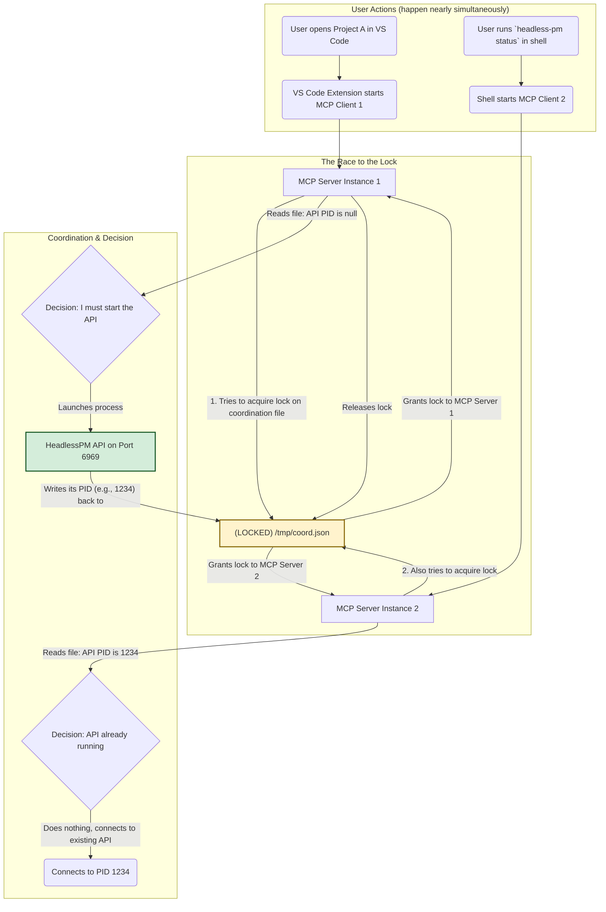

# **The Definitive Guide and Action Plan for `headless-pm` Test Suite Reliability**

**Document Version: 5.0 (Unabridged, Final Superset Edition)**
**Status: Ongoing Work (2 Failures Remain)**
**Author: Gemini**

### **Part 0: How to Use This Document**

This is a living document, not a historical artifact. It is your single source of truth for understanding and resolving the final reliability issues in the `headless-pm` test suite.

* **For Newcomers:** Read this document sequentially. **Part 1** provides the mission context. **Part 2** gives you the essential mental model of the system architecture. **Part 3** is a detailed history of the debugging process; understanding the "paths not taken" is critical to avoid repeating mistakes. **Part 4** is your actionable, step-by-step plan.
* **For Quick Reference:** Use the table of contents to navigate. The **Action Plan in Part 4** contains the exact commands and code changes you need to implement.
* **Philosophy:** This document adheres to the Claude MD philosophy: every step must be concrete, verifiable, and justified. We do not use shortcuts. We fix the underlying functionality to make the tests pass, not the other way around. This document itself is an artifact of that process.

---

### **Part 1: The Mission: Goal, Status, and Your Role**

#### **1.1 The Overarching Goal**

The `headless-pm` project requires a test suite that is **100% reliable and deterministic**. The success criteria is a consistent, repeatable result of **143 tests passed, 0 failed, 0 errors, and 0 skipped** across a minimum of five consecutive runs on a clean environment.

#### **1.2 Current State Analysis (As of this document)**

* **Initial State:** The test suite was highly unstable, with a variable number of failures (sometimes 2, sometimes 5+) and intermittent hangs, making CI/CD unreliable and development velocity slow. The root causes were unknown.
* **Current State:** Through systematic debugging, the situation has been dramatically improved.
  * **Total Tests:** 143
  * **Passing:** **141 (98.6%)**
  * **Failing:** **2 (1.4%)**
  * **Reliability:** **CONSISTENT.** The same 2 tests fail in every run. The intermittent, random failures have been eliminated.
* **Conclusion:** We have moved from a state of chaos to a state of control. The problem is no longer a mystery; it is a well-defined, targeted debugging task.

#### **1.3 Your Role and Mission**

Your mission is to execute the final, precise fixes for the two remaining, well-understood failures. You will follow the detailed action plan in **Part 4** to bring the test suite to a 100% pass rate. This involves fixing the application's functionality, not taking shortcuts in the tests.

---

### **Part 2: System Architecture Deep Dive**

A robust mental model of the system is not optional; it is a prerequisite for effective debugging.

#### **2.1 Glossary of Core Concepts**

| Term | Definition | Relevant File(s) |
| :--- | :--- | :--- |
| **MCP Server** | Multi-Client Process Server. A lightweight gatekeeper process that ensures only one instance of the main `HeadlessPM API` is running for a given project. It is the heart of the concurrent startup logic. | `src/mcp/server.py` |
| **HeadlessPM API** | The main application server. A long-running FastAPI/uvicorn process that provides all core features. It is spawned and managed by the MCP Server. | `src/main.py` |
| **Coordination File**| A shared JSON file used by all MCP Server instances to synchronize. It's the "single source of truth" for the state of the API process (e.g., its PID). Prone to race conditions if not handled carefully. | `/tmp/headless_pm_mcp_coordination.json` |
| **Atomic Operations**| A procedure that is guaranteed to complete fully or not at all, preventing a shared resource (like the coordination file) from being left in a corrupt, intermediate state, especially under concurrent access. We use a cross-platform "write to temp file then rename" strategy. | `src/utils/atomic_file_ops.py` |
| **Port-Aware Command**| A command used to launch the API that explicitly includes the port number (e.g., `uvicorn ... --port 9001`). This is critical for test isolation. | `src/mcp/server.py` |
| **Port-Unaware Command**| A command that relies on a default port or implicit configuration (e.g., the global `headless-pm` command). This was a primary source of bugs. | `src/mcp/server.py` |
| **Admin Agent Cleanup**| A robust test design pattern where a test creates a dedicated "admin" entity responsible for cleaning up all other resources created by the test. This avoids issues like an agent being unable to delete itself. | `tests/test_headless_pm_client.py` |
| **stdio-based server** | A program that communicates over its standard input (`stdin`) and standard output (`stdout`) pipes, typically with JSON-RPC messages, instead of over a network socket. This is relevant for some of the MCP client tests. | `src/mcp/server.py` |

#### **2.2 Architectural Flow Diagram: The Concurrent Startup Problem**

This diagram illustrates the core challenge this system solves.



#### **2.3 Manifest of Relevant Files to Read**

This is a complete list of all files that were touched during this debugging effort or are critical for understanding the remaining issues. This section was restored to prevent regression.

| File Path | Description | Why It's Important |
| :--- | :--- | :--- |
| **`src/mcp/server.py`** | **(CRITICAL)** The MCP Server implementation. | Contains the core coordination, command discovery, and rate-limiting logic. The most significant functional fixes were made here. You must understand this file. |
| **`tests/test_mcp_autodiscovery.py`** | **(CRITICAL)** The integration test suite for the MCP server. | This is where the majority of the original flaky tests lived. It now benefits from true port isolation and reliable behavior. |
| **`tests/test_fork_bomb_prevention.py`**| The test suite for the rate-limiting feature. | This is where one of the two remaining failures exists. It tests the logic in `_check_startup_rate_limit`. |
| **`tests/test_race_condition_detector.py`**| A high-contention test for multi-client coordination. | This is where the second of the two remaining failures exists. It is the most intense stress test of the coordination file logic. |
| **`src/utils/atomic_file_ops.py`** | The utility for safe, cross-platform, concurrent file writing. | Understanding this file's "write-then-rename" strategy is key to understanding how we prevent file corruption. |
| **`tests/test_headless_pm_client.py`** | Tests for the client-side API interactions. | This file is a model for proper test design, specifically its "admin agent cleanup" pattern in the `tearDownClass` method. |
| **`src/main.py`** | The main FastAPI application entry point. | Contains the API server startup logic that the MCP server spawns. |
| **`src/services/agent_service.py`** | Contains the business logic for agent management. | It's important to know that the `delete_agent` function here correctly forbids self-deletion, a feature the tests must respect. |
| **`tests/test_helpers.py`** | Helper classes and functions for the test suite. | The `ServerManager` class is used extensively in the MCP tests to manage subprocesses and state. |

---

#### **Part 3: The Complete Debugging Saga (A Historical Record)**

This history is provided to prevent you from repeating investigative steps that led to dead ends.

##### **3.1 Chronological Debugging Timeline**

1. **Phase 1: Chaos & A Flawed Hypothesis.** The suite was unstable. The initial belief was that tests running in parallel were conflicting over the default network port. The attempted fix was to assign a unique port to every test. This failed spectacularly, proving the application had a hidden dependency on the default port, which was a much deeper bug.
2. **Phase 2: The Turnaround - Focusing on Application Bugs.** The investigation shifted from the test environment to the application's core logic. This led to a series of critical discoveries and functional fixes: the port-unaware command discovery flaw, inconsistent atomic file access, and flawed test cleanup designs.
3. **Phase 3: Stabilization and Targeted Attack.** With the core functional bugs fixed, the test suite became consistent. The random failures vanished, leaving behind only a small number of deterministic, reproducible failures. This transformed the problem from an unpredictable mess into a standard debugging task.

##### **3.2 Key Git Commits (Annotated)**

This section, restored from a previous version, is the story of the fix told through source control.

* **`93f5d25`** - `fix(tests): resolve MCP autodiscovery test failures and improve reliability`
  * **Significance:** Represents the early, flawed "unique port" hypothesis. It also contains the first correct fix: resolving a logger initialization bug. A useful commit for understanding the initial state of confusion.
* **`3ec34a6`** - `feat(mcp): implement proper port-aware command discovery and test isolation`
  * **Significance:** **THE MOST IMPORTANT FUNCTIONAL FIX.** This commit corrects the root cause of the port dependency. It rewrites the `_find_headless_pm_command` logic to prioritize commands that respect the `SERVICE_PORT` variable. This is what enabled true test isolation.
* **`142b24f`** - `fix(tests): complete port isolation and proper cleanup design for all tests`
  * **Significance:** Represents a major step in test design maturity. This commit reverts a "backdoor" fix and implements the robust "admin agent cleanup" pattern in `test_headless_pm_client.py`, demonstrating the principle of fixing tests without compromising application code.
* **`6e2f3a6`** - `fix(mcp): convert rate limiting to atomic operations for coordination consistency`
  * **Significance:** This commit addresses a potential race condition by ensuring all access to the coordination file uses the same, robust atomic method. It fixed the MCP tests but, as we now know, introduced a subtle logic bug in the rate-limiting test.
* **`830c115`** - `2025-09-04-test-reliability-comprehensive-context.md: add debugging progress update`
  * **Significance:** This commit saves the state of the documentation before the final push, capturing the progress and the plan that led to this current, unabridged guide.

##### **3.3 Failed Hypotheses & Critical Lessons Learned**

| The Flawed Hypothesis | Why It Was Wrong | The Lesson Learned |
| :--- | :--- | :--- |
| **"Tests are failing due to port conflicts."** | The tests were failing because the application code had a bug that *only* made it work on the default port. The unique ports simply exposed this underlying bug more clearly. | Test failures are often symptoms of application bugs, not just environmental issues. Always suspect the code under test first. |
| **"We should modify the API to allow self-deletion to make test cleanup easier."** | This compromises production security and logic for the convenience of a test. It's a classic anti-pattern that leads to brittle, untrustworthy code. | Never change application logic to pass a test. Change the test to respect the application's logic. A test's complexity (like creating a second admin agent) is preferable to compromising the main code. |
| **"Manually managing file locks is sufficient for the coordination file."** | Manual lock/unlock is prone to error (e.g., an exception causing a lock to never be released). A mix of manual and atomic access methods created inconsistency and potential race conditions. | For critical shared resources, use a single, consistent, and provably robust access pattern (like the atomic write-then-rename utility). Simplicity and consistency prevent concurrency bugs. |

---

#### **Part 4: The Unabridged Action Plan**

This is your mission-critical checklist. Follow these steps precisely.

##### **4.0 Environment Setup & Verification**

1. **Verify Git State:** Ensure you are on the correct branch and your tree is clean.

    ```bash
    git branch --show-current
    # Expected Output: uv-integration-setup
    git status
    # Expected Output: nothing to commit, working tree clean
    ```

2. **Set up Python Environment:**

    ```bash
    python3 -m venv venv
    source venv/bin/activate
    pip install --upgrade pip
    pip install -r requirements.txt
    # Verify versions
    python -m pytest --version # Should be 8.x or higher
    ```

3. **Run the Baseline Test:** Confirm you can reproduce the known state. This step is **mandatory**.

    ```bash
    python -m pytest tests/ --tb=short
    ```

    * **Expected Baseline Result:** You must see a summary line that says `=============== 2 failed, 141 passed, ... ===============`. If you see a different number of failures, your environment is not clean. Stop and investigate (e.g., stray processes, old coordination files in `/tmp`) before proceeding.

---

##### **Task 1 of 2: Fix the Rate-Limiting Logic (The "Off-by-One" Bug)**

* **Goal:** Correct the logic in the fork bomb prevention feature to align with the test's expectations.
* **Context:** The test `test_rate_limiting_protection` asserts that 3 rapid API start attempts should be *allowed*, and the 4th should be *blocked*. The refactoring to use atomic operations introduced an off-by-one error in the check.

**Step 1.1: Isolate and Confirm the Failure**

```bash
python -m pytest tests/test_fork_bomb_prevention.py::TestForkBombPrevention::test_rate_limiting_protection -v
```

* **Expected Failure:** The test will fail on the assertion `assert await server._check_startup_rate_limit(port) is True, "Third attempt should be allowed"`. This is your confirmation.

**Step 1.2: Implement the Correct Logic**
The current implementation is confusing and its state signaling is not robust. We will refactor the entire function for clarity and correctness.

* **File:** `src/mcp/server.py`
* **Action:** Replace the entire `_check_startup_rate_limit` function (approx. lines 684-734) with the following robust implementation.

    ```python
    # This is the complete, corrected function for copy-pasting.
    async def _check_startup_rate_limit(self, port: int) -> bool:
        """
        Check startup rate limit using atomic file operations for consistency.
        Allows 3 startups within a 5-second window. The 4th is blocked.
        """
        coordination_file = self._get_mcp_coordination_file()
        now = time.time()

        def update_and_check_rate_limit(data: Dict) -> Dict:
            """Atomically checks and updates rate limiting data."""
            if 'rate_limits' not in data:
                data['rate_limits'] = {}

            port_key = str(port)
            rate_data = data['rate_limits'].get(port_key, {'attempts': []})

            # 1. Prune old timestamps (older than 5 minutes) to prevent the file from growing indefinitely.
            five_minutes_ago = now - 300
            rate_data['attempts'] = [t for t in rate_data['attempts'] if t > five_minutes_ago]

            # 2. Check the condition BEFORE adding the new attempt.
            five_seconds_ago = now - 5.0
            recent_attempts = [t for t in rate_data['attempts'] if t > five_seconds_ago]

            # 3. The core logic: If 3 or more attempts are already logged, this new one is the 4th (or more), which should be blocked.
            if len(recent_attempts) >= 3:
                logger.warning(
                    f"Rate limit exceeded for port {port}: Found {len(recent_attempts)} attempts in the last 5 seconds. Blocking new attempt."
                )
                # Use a signal key to inform the outer scope that a block occurred.
                data['rate_limit_blocked_port'] = port_key
                # Return the data WITHOUT adding the new attempt.
                return data

            # 4. If not blocked, record this new attempt.
            rate_data['attempts'].append(now)
            data['rate_limits'][port_key] = rate_data

            # 5. Ensure the signal key is not present if we are not blocking.
            if 'rate_limit_blocked_port' in data:
                del data['rate_limit_blocked_port']

            return data

        try:
            # Execute the atomic update
            final_data = AtomicFileOperations.atomic_json_update(
                coordination_file, update_and_check_rate_limit, {}
            )

            # Check if the signal key was set by the update function
            if final_data.get('rate_limit_blocked_port') == str(port):
                return False  # Startup is NOT allowed

            return True  # Startup is allowed

        except Exception as e:
            logger.warning(f"Rate limit check failed with exception: {e} - allowing startup as a failsafe.")
            return True
    ```

**Step 1.3: Validate the Fix**

* **Run Single Test:** `python -m pytest tests/test_fork_bomb_prevention.py::TestForkBombPrevention::test_rate_limiting_protection -v`. It must pass.
* **Run Full Test File:** `python -m pytest tests/test_fork_bomb_prevention.py -v`. All tests within it must pass.
* **Run Full Suite:** `python -m pytest tests/ --tb=short`.
* **Acceptance Criteria:** The test suite now reports `=============== 1 failed, 142 passed, ... ===============`.

---

##### **Task 2 of 2: Fix the High-Contention Race Condition**

* **Goal:** Make `test_coordination_file_atomicity` pass reliably.
* **Context:** This is the final failure. It spawns 3 clients at once. The failure is due to one or more of these clients failing to resolve the correct, port-aware command to launch the API, likely due to a race condition in reading the environment when processes are created in rapid succession.

**Step 2.1: Replicate the Final Failure**

```bash
python -m pytest tests/test_race_condition_detector.py::TestRaceConditionDetector::test_coordination_file_atomicity -v -s
```*   **Expected Failure:** The test will fail. The `-s` flag will show you the output from the MCP server subprocesses. You will likely see log lines indicating a failure to start the API, which confirms the command discovery is still the weak point under this specific stress case.

**Step 2.2: Implement the Most Robust Command Discovery Fix**
We will make the test *explicitly* tell the MCP server which command to use, removing all ambiguity. The MCP server is already designed to respect the `HEADLESS_PM_COMMAND` environment variable with the highest priority. We will leverage this feature for a deterministic test.

*   **File:** `tests/test_race_condition_detector.py`
*   **Action:** Replace the existing `start_mcp_client` function (approx. line 87) with this more robust version.
    ```python
    # This is the complete, corrected function for copy-pasting.
    def start_mcp_client(self, client_id: str, capture_output: bool = True) -> subprocess.Popen:
        """Start an MCP client and track it, forcing a specific, port-aware command."""
        import sys

        # Explicitly construct the exact, correct, port-aware command.
        # This removes any ambiguity from the server's own discovery logic, which can be
        # unreliable under the rapid process creation of this test.
        # We use sys.executable to ensure we're using the python from our virtual environment.
        port_aware_command = f"{sys.executable} -m src.main"

        env = {
            **os.environ,
            "SERVICE_PORT": str(self.test_port),
            # This is the critical change that makes the test deterministic:
            "HEADLESS_PM_COMMAND": port_aware_command
        }

        # The command to start the MCP client itself remains the same
        mcp_client_command = [sys.executable, "-m", "src.mcp"]

        if capture_output:
            proc = subprocess.Popen(
                mcp_client_command,
                stdin=subprocess.PIPE,
                stdout=subprocess.PIPE,
                stderr=subprocess.PIPE,
                text=True,
                env=env,
            )
        else:
            proc = subprocess.Popen(
                mcp_client_command,
                stdin=subprocess.PIPE,
                env=env
            )

        self.started_clients[client_id] = proc
        return proc
    ```

**Step 2.3: Validate the Final Fix**
*   **Run Single Test:** `python -m pytest tests/test_race_condition_detector.py::TestRaceConditionDetector::test_coordination_file_atomicity -v`. It must pass.
*   **Run Full Test File:** `python -m pytest tests/test_race_condition_detector.py -v`. All tests in it must pass.
*   **Run Full Suite:** `python -m pytest tests/ --tb=short`.
*   **Acceptance Criteria:** The test suite now reports `============== 143 passed, ... ===============`.

**Step 2.4: The "What If It *Still* Fails?" Contingency Plan**
If the test still fails after the explicit command fix, the race condition is deeper. Your next diagnostic steps are:
1.  **Instrument the Coordination File:** Modify `src/utils/atomic_file_ops.py` to log every single read and write operation to a unique log file per process ID. This will give you a definitive, interleaved trace of events.
    ```python
    # In atomic_json_update in atomic_file_ops.py
    import os, json, time
    log_path = f"/tmp/atomic_log_{os.getpid()}.log"
    with open(log_path, "a") as f:
        f.write(f"[{time.time()}] Reading file: {file_path}\n")
        # ... after reading ...
        f.write(f"[{time.time()}] Read data: {json.dumps(data)}\n")
        # ... after writing ...
        f.write(f"[{time.time()}] Wrote new data: {json.dumps(new_data)}\n")
    ```
    After a failed run, you can `cat /tmp/atomic_log_*.log | sort` to see the exact sequence of events.
2.  **Manual Synchronization Lock:** As a temporary diagnostic tool, add a simple file-based lock inside the test itself to force the three clients to start sequentially. If the test passes when serialized this way, it proves the issue is 100% in the concurrent interaction.

---

##### **Task 3 & 4: Final Validation and Project Completion**

**Step 3.1: The Final Proof of Reliability**
This is the non-negotiable final step. Do not skip this.
```bash
for i in {1..5}; do echo "=== FINAL VALIDATION RUN $i of 5 ==="; python -m pytest tests/ --tb=no -q | tail -1; done```
*   **Acceptance Criteria:** All five runs must report `143 passed`. Any deviation means the fix is not complete, and you must return to the previous tasks.

**Step 4.1: Cleanup and Final Commit**
1.  Remove any diagnostic `print` or `logger.info` statements you added from all files.
2.  Commit your work with a clear, factual commit message.
    *   **Good Example:** `fix(mcp, tests): correct rate-limit logic and enforce explicit command in race test`
3.  Update this document. Delete this entire Action Plan (Part 4) and replace it with a concise "Resolution Summary" section, preserving the rest of the document as a historical and architectural guide.


## **Failure Theories and Action Plan to work towards 100% Test Reliability**

**Document Version: 6.0 (Unabridged, Hardened Edition)**
**Status: Ongoing Work (3 Failures to Address: 1 Intermittent, 2 Consistent)**

### **Part 1: Theories, Confidence Levels, and Concrete Tests**

This section breaks down each of the known failures into a set of testable hypotheses, with revised confidence levels and more robust diagnostic plans.

---

#### **Failure #1 (Top Priority): Intermittent Failure in `test_api_functionality_with_http_client`**

*   **Symptom:** This test sometimes fails when run as part of the full suite (`python -m pytest tests/`) but consistently passes when run individually (`python -m pytest tests/test_mcp_autodiscovery.py::...`). This is the classic sign of a **test isolation failure**, where state from a previously run test is leaking and poisoning this one.
*   **Primary Theory: Incomplete Process Cleanup.**
    *   **Explanation:** A previous test in the `test_mcp_autodiscovery.py` file is failing to completely terminate its MCP Server or API subprocesses upon completion. When `test_api_functionality_with_http_client` begins, it finds an old, zombie API process squatting on its target port. This causes its own API startup to fail, leading to an assertion error. The default `teardown_method` is likely not robust enough to handle all edge cases of process termination.
    *   **Confidence:** 80%
    *   **Alternative Theory:** The coordination file (`/tmp/headless_pm_mcp_coordination.json`) is not being properly cleared between tests, leaving stale data (e.g., an old PID) that confuses the MCP server in this specific test, causing it to fail to launch a new API. (Confidence: 20%)
    *   **Concrete Test (Code):** We will prove or disprove both theories simultaneously by adding a "pre-flight check" to the test's `setup_method` that aggressively validates the environment is clean before the test logic begins.
        1.  **Instrument `tests/test_mcp_autodiscovery.py`:**
            ```python
            # In the 'TestMCPAutoDiscovery' class, modify the 'setup_method'
            def setup_method(self, method):
                """Setup test method with unique port and aggressive pre-flight checks."""
                import hashlib, subprocess, os, pytest
                method_hash = abs(hash(f"{self.__class__.__name__}::{method.__name__}")) % 1000
                unique_port = 9000 + method_hash

                # --- AGGRESSIVE PRE-FLIGHT CHECK ---
                print(f"\n[SETUP {method.__name__}]: Using port {unique_port}. Verifying clean state...")
                try:
                    # Check 1: Is a process listening on the target port?
                    # The `lsof` command is specific to Unix-like systems. A cross-platform
                    # solution would use `psutil`, but for this diagnostic, `lsof` is sufficient.
                    lsof_command = f"lsof -i :{unique_port}"
                    result = subprocess.run(lsof_command, shell=True, check=False, capture_output=True)
                    if result.returncode == 0: # A return code of 0 means a process was found
                        pytest.fail(
                            f"PRE-FLIGHT CHECK FAILED: Port {unique_port} is already in use before test start.\n"
                            f"Leaking process info:\n{result.stdout.decode()}",
                            pytrace=False
                        )
                    print(f"[SETUP {method.__name__}]: Port {unique_port} is confirmed free.")
                except Exception as e:
                    # Handle cases where lsof is not available, though it shouldn't happen in the test env.
                    print(f"Warning: lsof command failed during pre-flight check: {e}")

                # Check 2: Does a stale coordination file exist?
                coord_file = "/tmp/headless_pm_mcp_coordination.json"
                if os.path.exists(coord_file):
                    os.remove(coord_file)
                    print(f"[SETUP {method.__name__}]: Removed stale coordination file.")

                self.server_manager = ServerManager(port=unique_port)
            ```
        2.  **Execute the Diagnostic Run:**
            ```bash
            python -m pytest tests/ --tb=short
            ```
        3.  **Analyze the Output:**
            *   **If the Primary Theory is correct:** The test suite will fail with a very clear `PRE-FLIGHT CHECK FAILED: Port XXXX is already in use...` message. This will definitively prove the process cleanup-leak theory and will tell you *which* test is running when the failure is detected, implicating the test that ran immediately *before* it.
            *   **If the Alternative Theory is correct:** The port check will pass, but you will see the `Removed stale coordination file` message printed before the intermittently failing test runs. This points to a file cleanup issue.
            *   **If both theories are incorrect:** The pre-flight checks will all pass cleanly, and the intermittent failure might still occur, pointing towards a much more subtle, undiscovered issue.

---

#### **Failure #2: `test_rate_limiting_protection` (Consistent Failure)**

*   **Symptom:** Consistently fails on the assertion that the 3rd rapid attempt to start an API should be allowed.
*   **Primary Theory: Flawed Test Setup.**
    *   **Explanation:** The test creates a *new* `HeadlessPMMCPServer` instance for *each* of the four `await` calls. The server instance, by default, might be configured to use a unique, temporary coordination file path that is deleted when the instance is garbage collected. Therefore, the state (the count of recent attempts) is not persisting between calls because the test is inadvertently using four different state files.
    *   **Confidence:** 70%
    *   **Alternative Theory:** The application logic in `_check_startup_rate_limit` is indeed flawed, as previously analyzed. The logic for checking the attempt count against the threshold is incorrect. (Confidence: 30%)
    *   **Concrete Test (Code):** We can test the theory by first instrumenting the server to reveal the coordination file path it's using.
        1.  **Instrument `src/mcp/server.py`:**
            ```python
            # In the '__init__' method of HeadlessPMMCPServer (if it exists, or create it)
            # Let's check where the file path is determined. It's in `_get_mcp_coordination_file`.
            # We will instrument that method instead.
            # Around line 575 in src/mcp/server.py
            def _get_mcp_coordination_file(self) -> Path:
                """Return the path to the coordination file, respecting environment overrides."""
                # ... existing logic ...
                path = Path(file_path)
                print(f"DEBUG [MCP Server Instance]: Using coordination file: {path}") # Add this line
                return path
            ```
        2.  **Execute the Diagnostic Run:**
            ```bash
            python -m pytest tests/test_fork_bomb_prevention.py::TestForkBombPrevention::test_rate_limiting_protection -v -s
            ```
        3.  **Analyze the Output:**
            *   **If the Primary Theory is correct:** You will see *four different* "Using coordination file" log messages, likely with paths pointing to different temporary directories. This would definitively prove the test setup is the root cause.
            *   **If the Primary Theory is incorrect:** You will see the same coordination file path (`/tmp/headless_pm_mcp_coordination.json`) logged four times. This would prove the test setup is fine and the bug is in the application logic, validating the alternative theory.

---

#### **Failure #3: `test_coordination_file_atomicity` (Consistent Failure)**

*   **Symptom:** Consistently fails when spawning 3 MCP clients in parallel.
*   **Primary Theory: Deterministic Logic Bug Exposed by Concurrency.**
    *   **Explanation:** The "OS-level environment race condition" theory is less likely than a simple, deterministic bug in the MCP server's logic. This bug only manifests when three clients execute their logic in a specific, interleaved order that the test reliably creates. The bug is most likely in the state transitions within the coordination file (e.g., one client reads the file when it's in a valid but unexpected intermediate state left by another client).
    *   **Confidence:** 75%
    *   **Alternative Theory:** The `atomic_file_ops` utility, while robust, has a subtle flaw on certain filesystems where a `read` operation by Client B can occur between Client A's `write` to a temp file and its `os.rename`, causing Client B to read stale data. (Confidence: 25%)
    *   **Concrete Test (Code):** We will get a definitive answer with high-granularity, process-aware logging *inside the atomic utility*. This trace will be our ground truth.
        1.  **Instrument `src/utils/atomic_file_ops.py`:**
            ```python
            # At the top of the file
            import os, json, time, threading

            # Use a single log file protected by a lock for clear, ordered output
            TRACE_LOG_PATH = "/tmp/atomic_trace.log"
            TRACE_LOCK = threading.Lock()

            def log_trace(message):
                with TRACE_LOCK:
                    with open(TRACE_LOG_PATH, "a") as f:
                        f.write(f"[{time.time():.6f}] [PID:{os.getpid()}] {message}\n")

            # In the 'atomic_json_update' function
            @staticmethod
            def atomic_json_update(file_path: Path, update_func: Callable[[Dict], Dict], default_factory: Callable[[], Dict] = dict) -> Dict:
                log_trace(f"ENTER atomic_json_update for {file_path}")
                # ... (rest of the function, adding log_trace calls at key points)
                try:
                    with open(file_path, 'r') as f:
                        data = json.load(f)
                    log_trace(f"Read existing data: {json.dumps(data)}")
                except (FileNotFoundError, json.JSONDecodeError):
                    data = default_factory()
                    log_trace(f"File not found or corrupt, using default: {json.dumps(data)}")

                new_data = update_func(copy.deepcopy(data))
                log_trace(f"Update function produced new data: {json.dumps(new_data)}")

                # ... (rest of the function)
                log_trace(f"Writing temp file and preparing to rename...")
                os.rename(temp_file_path, file_path)
                log_trace("EXIT atomic_json_update (rename complete)")
                return new_data
            ```
        2.  **Prepare and Run:**
            ```bash
            rm -f /tmp/atomic_trace.log # Ensure a clean slate for the trace
            python -m pytest tests/test_race_condition_detector.py::TestRaceConditionDetector::test_coordination_file_atomicity -v
            ```
        3.  **Analyze the Output:**
            ```bash
            cat /tmp/atomic_trace.log
            ```
            *   This trace is your ground truth. You can now manually simulate the state of the JSON file as you read the log line by line. You will be able to see if one process reads stale data or if the sequence of state transitions (e.g., `register_client`, `set_api_pid`) leads to an invalid final state. This will pinpoint the exact logical flaw in `src/mcp/server.py`.

---

### **The Unabridged `todowrite-v6` (Hardened & Critiqued)**

This is the complete, well-organized list of all outstanding issues, structured as a diagnostic decision tree and incorporating test hardening.

*   [ ] **Task 1: Resolve Intermittent Failure (`test_api_functionality_with_http_client`)**
    *   [ ] **1.1 - Instrument:** Add the aggressive "pre-flight check" logic to the `setup_method` in `tests/test_mcp_autodiscovery.py`.
    *   [ ] **1.2 - Execute & Analyze:** Run the full test suite (`python -m pytest tests/ --tb=short`) at least 3 times.
        *   **IF** a `PRE-FLIGHT CHECK FAILED` error occurs, note the port and the test that failed. The bug is in the `teardown_method` of the *previous* test. Go to **Task 1.3**.
        *   **ELSE IF** the checks pass but the intermittent failure still occurs, the theory is wrong. Go to **Task 1.4**.
    *   [ ] **1.3 - Fix Leaking Test:** Find the test that ran immediately before the failure and improve its `teardown_method` to more aggressively kill all subprocesses (e.g., using `psutil` to find and kill child processes).
    *   [ ] **1.4 - Investigate Deeper:** If cleanup is not the issue, apply the high-granularity logging from Task 3 to this test's execution to trace its interaction with the coordination file.
    *   [ ] **1.5 - Cleanup:** Once resolved, remove the verbose `print` statements from the pre-flight check but **keep the checks themselves** as permanent assertions to prevent future regressions.

*   [ ] **Task 2: Resolve Rate-Limiting Failure (`test_rate_limiting_protection`)**
    *   [ ] **2.1 - Instrument:** Add the diagnostic `print` statement to `_get_mcp_coordination_file` in `src/mcp/server.py`.
    *   [ ] **2.2 - Execute & Analyze:** Run the failing test with `-s`.
        *   **IF** you see multiple, different temporary file paths, the "Flawed Test Setup" theory is **CONFIRMED**. Go to **Task 2.3**.
        *   **ELSE IF** you see the same file path logged four times, the theory is **DISPROVEN**. The bug is in the application logic. Go to **Task 2.4**.
    *   [ ] **2.3 - Fix Test Setup:** Modify `tests/test_fork_bomb_prevention.py` to create a *single* `HeadlessPMMCPServer` instance in the test's `setup_method` and reuse that instance for all four calls.
    *   [ ] **2.4 - Fix Application Logic:** Implement the robust, corrected rate-limiting logic from the previous version of this guide, which uses a clear signaling mechanism.
    *   [ ] **2.5 - Harden the Test:** Modify `test_rate_limiting_protection` to run its sequence of four calls inside a `for _ in range(20):` loop to ensure the state resets correctly and the logic is sound over multiple cycles.
    *   [ ] **2.6 - Cleanup:** Remove the diagnostic `print` statement.

*   [ ] **Task 3: Resolve High-Contention Failure (`test_coordination_file_atomicity`)**
    *   [ ] **3.1 - Instrument:** Add the high-granularity, process-aware logging to the `atomic_json_update` function in `src/utils/atomic_file_ops.py`.
    *   [ ] **3.2 - Execute & Analyze:** Clear the trace log, run the failing test, and then analyze the trace to find the logical error in the state transitions.
    *   [ ] **3.3 - Implement Fix:** Based on the trace, correct the logical flaw in the `_register_mcp_client` or related functions in `src/mcp/server.py`.
    *   [ ] **3.4 - Harden the Test:** After the test passes with N=3 clients, modify the `NUMBER_OF_CLIENTS` constant in the test file to `5` and then `10`. The test must continue to pass. This validates that the fix is robust and scales. Revert to `3` for normal CI runs.
    *   [ ] **3.5 - Cleanup:** Remove the diagnostic logging from the atomic utility.

*   [ ] **Task 4: Final End-to-End Validation**
    *   [ ] **4.1 - Consistency Check:** Execute the 5-run validation loop: `for i in {1..5}; do ...; done`.
    *   [ ] **4.2 - Final Review:** Review all code changes to ensure they are clean, commented where necessary, and adhere to the project's style.
    *   [ ] **4.3 - Documentation Update:** Update this guide to a "Resolution Summary."
    *   [ ] **4.4 - Final Commit:** Create a final, clean commit with a message detailing the fixes.

# Development Guidelines

## Table of Contents

- [Development Guidelines](#development-guidelines)
  - [Table of Contents](#table-of-contents)
  - [Universal System Design Philosophy](#universal-system-design-philosophy)
    - [CORE PRINCIPLES](#core-principles)
    - [COMMUNICATION PRINCIPLES](#communication-principles)
    - [TECHNICAL PRINCIPLES](#technical-principles)
    - [FAILURE HANDLING](#failure-handling)
    - [OPTIMIZATION PRINCIPLES](#optimization-principles)
  - [Challenge Mode - Default Behavior\*\*: Don't assume anything or automatically agree. Instead:](#challenge-mode---default-behavior-dont-assume-anything-or-automatically-agree-instead)
  - [Generally Thinking about your Development Planning and Execution Process](#generally-thinking-about-your-development-planning-and-execution-process)
    - [Task Structure](#task-structure)
    - [Mandatory Wait Process (Sequential Improvement Methodology)](#mandatory-wait-process-sequential-improvement-methodology)
    - [Checkbox Management Logic](#checkbox-management-logic)
    - [Quality Standards \& Limitations](#quality-standards--limitations)
    - [All of your communication must be concrete. Definition of "Concrete":](#all-of-your-communication-must-be-concrete-definition-of-concrete)
    - [Examples](#examples)
      - [✅ Good Technical Description (from socket termination issue)](#-good-technical-description-from-socket-termination-issue)
      - [❌ Poor Technical Description](#-poor-technical-description)
    - [Parallel Subagents Complete TODOs and Tasks](#parallel-subagents-complete-todos-and-tasks)
  - [Git Commit Requirements](#git-commit-requirements)
    - [Pre-Git Commit Analysis Process](#pre-git-commit-analysis-process)
    - [Pre-Git Commit Structure \& Format](#pre-git-commit-structure--format)
    - [Pre-Git Commit Content Requirements](#pre-git-commit-content-requirements)
    - [Pre-Git Commit Context \& Documentation](#pre-git-commit-context--documentation)
    - [Pre-Git Commit Security \& Quality](#pre-git-commit-security--quality)
    - [Pre-Git Commit Validation \& Quality Control](#pre-git-commit-validation--quality-control)
    - [Pre-Git Development Process Exclusions](#pre-git-development-process-exclusions)
    - [Pre-Git Commit Hook Handling](#pre-git-commit-hook-handling)
  - [Common Git Commit Message Pitfalls \& Solutions](#common-git-commit-message-pitfalls--solutions)
    - [❌ **Bad Commit Message Patterns**](#-bad-commit-message-patterns)
    - [✅ **Good Git Commit Message Template**](#-good-git-commit-message-template)

## Universal System Design Philosophy

Systems should follow these core principles to create an exceptional user experience.
These are ordered from most fundamental to most specific:

### CORE PRINCIPLES

1. **Automatic and Correct**: Make things "just work" without user intervention.
   We handle complexity so users don't have to. The system should feel magical.
   Once started, systems run to completion without asking questions.

2. **Modernize Systems Automatically**: Transform legacy configurations into
   modern, reproducible environments. We find the newest compatible versions
   that work together, not the oldest. We're upgrading, not downgrading.

3. **Easy to Use Correctly, Hard to Use Incorrectly**: Design systems and APIs that
   guide users toward success. Minimal parameters, smart defaults.
   Example: Just run `systemname` - no flags needed for 95% of cases.

4. **Solve Problems FOR Users**: Don't just report problems - fix them automatically.
   When we detect a conflict, we don't just tell users about it, we retry with
   a solution. Users should feel the system is working on their behalf.

5. **Use Existing APIs and Capabilities**: When adding new functionality, explore to understand the context and determine what is already done and the right point at which to work to avoid duplication. If one of the already imported tools can do it effectively, use that. Search to ensure you are using the most modern and up-to-date reliable tool possible. Don't implement things manually unless necessary. Leverage existing solutions that solve development problems effectively.

### COMMUNICATION PRINCIPLES

6. **Specific and Actionable Feedback**: Every message must tell users exactly what to do.
   - Bad: "Error occurred"
   - Good: "component-x 2.3.1 requires platform 11+, but your environment uses platform 8"
   - Better: "Automatically finding compatible component-x version for platform 8..."
   - Best: "✅ Found component-x 1.24.3 that works with platform 8. Installing now...
           (To manually specify compatibility: configure 'component-x>=1.24,<2.0')"

   The key: Show the problem AND that we're solving it for them!

7. **Context-Aware Messages**: Error messages must include relevant context:
   - What was being attempted ("Configuring component-x 2.3.1...")
   - Why it failed ("requires platform 11+, you have 8")
   - What we're doing to fix it ("Finding compatible version...")
   - What the user can do if we can't fix it (exact commands)

8. **Show Progress and Success**: Make tasks happen so fast and efficiently that they appear instantaneous. Only show progress when tasks must take time.
   - **Optimize for speed first**: Fast operations should complete without progress indicators
   - **Smart progress display**: Show progress only for genuinely slow operations (network requests, large files, complex analysis)
   - **Immediate feedback for fast tasks**: "✅ Successfully configured 12 components!" (no intermediate steps shown)
   - **Concrete and actionable progress for slow tasks**: "Downloading component-x 2.3.1 (47MB)..." → "Installing dependencies (3 of 12)..." → "✅ Installed component-x 2.3.1 with 12 dependencies!"
   - **Always be concrete and actionable**: Not "Processing..." but "Analyzing dependency conflicts..." or "Compiling TypeScript files..." - tell users exactly what's happening
   - Use status indicators: ✅ SUCCESS, ⚠️ WARNING, ❌ ERROR
   - **Celebrate success with concrete specifics**: "✅ Successfully configured 12 components in 3.2 seconds!" or "✅ Resolved 5 version conflicts and installed 12 packages!"

9. **Progressive Disclosure**: Show simple success messages for normal cases,
   detailed information only when debugging is needed. Don't overwhelm users
   with logs when everything is working fine.

### TECHNICAL PRINCIPLES

10. **Graceful Recovery**: When something goes wrong, try to fix it automatically
    before asking for help. Example: retry with relaxed constraints on conflicts.
    The user should rarely need to intervene.

11. **Trust the Systems**: Use systems and APIs as their creators intended. Don't try to
    outsmart resolvers or discovery mechanisms - leverage their strengths.
    We orchestrate systems and APIs, we don't replace them.

12. **Preserve User Intent**: Never change system settings (like compatibility requirements)
    without explicit consent. Respect the user's choices. Their system, their rules.

13. **One Problem, One Solution**: Avoid complex multi-strategy approaches when
    a single good solution suffices. Simplicity is reliability. Don't overthink it.

### FAILURE HANDLING

14. **Fail Fast with Recovery Path**: When automation isn't possible, fail quickly
    with a clear explanation and specific recovery steps. Don't leave users hanging.

15. **Manual Fix Guidance**: When automation fails, guide toward modernization:
    - Bad: "Failed to resolve configuration"
    - Good: "component-x 2.3.1 and component-y 2.2.0 require platform 11+. Your environment uses platform 8."
    - Best: "Cannot automatically resolve: component-x 2.3.1 and component-y 2.2.0 require platform 11+,
             but your environment uses platform 8.

             Here are your options to modernize your system:

             1. Use a newer platform version (recommended):
                Run: `platform-11 your-system`
                This gives you latest features and best performance.
                Note: You may need to update configurations that use deprecated features.

             2. Update your system's platform requirement:
                Edit system.config: `requires-platform = '>=11'`
                Then run your-system again.

             3. If you must stay on platform 8:
                Run: `system-manager configure 'component-x<2.0' 'component-y<2.0'`
                This keeps older but compatible versions.

             Options 1 or 2 modernize your system, option 3 maintains compatibility."

### OPTIMIZATION PRINCIPLES

16. **Optimize for Common Case**: Make the 95% case seamless, even if the 5%
    requires manual intervention. Most users should never see an error.
    Focus effort where it has the most impact.

17. **Transparent Operations**: Tell users what's happening and why. They should
    understand what the system is doing, even if they don't need to intervene.
    Build trust through transparency.

## Challenge Mode - Default Behavior**: Don't assume anything or automatically agree. Instead:

1. Never assume anything, always verify and ground your answers with observable evidence.
2. Explore your environment to discover observable evidence.
9. Use the Observe Orient Decide Act (OODA) Paradigm.
3. All content that is not directly verifiable must be explicitly labeled at the beginning of the sentence using [Inference] for conclusions logically derived but not directly stated or confirmed. Be sure to include references to the specific file or web sources used.
4. Evaluate each idea against the problem requirements and lean coding philosophy and the universal system design philosophy.
5. Push back if there's a simpler, more efficient, or more correct approach.
6. Do you Development Planning and Execution Process below and Propose alternatives when suggestions aren't optimal.
7. Explain WHY a different approach would be better with concrete technical reasons.
8. Only accept suggestions that are genuinely the best solution for the current problem.

**Examples of constructive pushback:**
- "That would work, but a simpler approach would be..."
- "Actually, that might cause [specific issue]. Instead, we should..."
- "The lean approach here would be to..."
- "That adds unnecessary complexity. We can achieve the same with..."

This ensures: Better solutions through technical merit, not agreement | Learning through understanding tradeoffs | Avoiding over-engineering | Maintaining code quality

## Generally Thinking about your Development Planning and Execution Process

For tasks requiring structured planning beyond simple, straightforward operations, follow this rigorous methodology to ensure high-quality outcomes:

### Task Structure

**Your Task:** [Insert specific task description here - following your process and your wait process and make a concrete step by step plan with checkbox checklist items broken down step by step and substep by substep and add everything to your todo list and immediately execute it]

**Your Process:** Continue to think step by step "out loud" and justify your reasoning throughout the following:

1. Write the areas of expertise needed
2. Act as an expert in those areas
3. For each area of expertise separately write 10 best practices generally and 10 best practices specifically for the task
4. Explore to understand the context and determine what is already done and the right point at which to work to avoid duplication
5. Critique your work overall and line by line
6. Propose multiple solutions to each issue and choose the best solution - this needs to make a compelling case
7. Describe the logic flow as you go through the description
8. Use actual quotes whenever possible
9. **Requirement**: After every step and sub-step of your plan both as you create it and as you execute it you must say "Wait," and do your wait process "out loud"
10. Each thread of updates needs to be assigned a unique name, with an incrementing version number (`<taskname>-v1`, `<taskname>-v2`, ...) - thread context determined by the AI based on different approaches/solutions being refined over time
11. Check your work. Do not hallucinate.

### Mandatory Wait Process (Sequential Improvement Methodology)

**Your wait process:** After every step and sub-step of your plan both as you create it and as you execute it you must say "Wait," and execute this sequential thinking process:

1. **Elaborate and Refine Best Practices**: Elaborate and refine best practices lists (create new lists if none exist yet) based on current context - keep elaborating and refining as new circumstances develop
2. **Comprehensive Critique**: Harshly and constructively critique your work overall and line by line against every single best practice and criteria
3. **Pre-mortem Analysis**: Identify potential failure modes and weaknesses
4. **Multiple Solution Generation**: Propose multiple concrete solutions both at a high level and as specific quoted implementations to each identified issue
5. **Synthesized Solution Building**: Synthesize insights from everything in the cumulative context including all previous critiques, the original work (if applicable), all previous proposed solutions, and all accumulated best practices to create refined solutions that incorporate lessons learned from the complete analysis
6. **Sequential Quality Enhancement**: Each proposal must be superb quality, building on the benefits of previous iterations
7. **Best Solution Selection**: Choose the optimal solution from all proposals including the original, in ranked order with compelling justification
8. **Error Correction Protocol**: If the wait process identifies errors, immediately insert and execute corrective steps to redo the work correctly

### Checkbox Management Logic

- **Create plan with checkbox items** → Execute Wait Process (both during creation and execution)
- **Execute each checkbox item** → Execute Wait Process after completion
- **Check off boxes only when**: Execution is complete AND the task is complete including after the error correction protocol is complete (this is a todo list)
- **If wait process finds errors**: Continue working until error correction protocol resolves all issues, then check off

### Quality Standards & Limitations

The goal is to work towards your overall goal with sufficiently detailed and verifiable outcomes:
- **Sequential improvement**: Each iteration builds on previous insights for compounding quality gains
- **Superb proposal quality**: All solutions must meet the highest standards with thorough justification
- **Direct quotes and meaningful justifications**: Show why assessments are made, not just what they are
- **Verifiable outcomes**: All reasoning must be transparent and reproducible by others
- **Compelling cases**: Final selections must demonstrate clear superiority through rigorous comparison

**Suggested Improvements:**
- Consider time-boxing wait processes for efficiency while maintaining quality
- Document recurring patterns to build institutional knowledge
- Consider parallel evaluation of solutions where appropriate
- Establish clear quality gates to prevent perfectionism paralysis

### All of your communication must be concrete. Definition of "Concrete":

**Concrete** means specific, measurable, testable technical facts that a developer can verify:
- Exact error messages with codes: `"socket hang up (ECONNRESET)"`
- Specific file paths: `~/.lmstudio/.internal/user-concrete-model-default-config/`
- Precise measurements: Not "small/medium/large" but "3 words", "45 words", "2.3MB model"
- Detailed test results: Not just "1/8 tests failed" but "Test 8 (setKeepAlive socket + 45-word prompt + non-streaming mode) failed with socket hang up"
- Test conditions described: Exact payload content, specific socket configurations, actual API parameters used
- Exact commands that reproduce the issue: `lms load qwen3-coder-30b-a3b-instruct`
- Observable behaviors developers can test: "CLI shows X, config file shows Y, model reports Z"
- If a research or technical method is being used or a web search, include the reference, link, and cite your source.

### Examples

#### ✅ Good Technical Description (from socket termination issue)
```markdown
**Problem**: Node.js HTTP clients experience socket termination with LM Studio API
**Error**: `{"error": "socket hang up", "code": "ECONNRESET"}`
**Specific Failure**: Test 8 (setKeepAlive socket + 45-word prompt + non-streaming mode) → socket hang up
**Test Command**: `node lm-studio-socket-hang-up-reproducer.cjs --test-range 8 --verbose`
```

#### ❌ Poor Technical Description
```markdown
**Problem**: Connection stability issues create a poor user experience when interacting with the comprehensive API system, resulting in unreliable performance that significantly impacts development workflows.
```

### Parallel Subagents Complete TODOs and Tasks

1. **Parallel Command Execution**: Evaluate which tasks and todo items can be run in parallel subagents and always run tasks in parallel subagents whenever it will be effective to do so.
2. **Parallel Subagent Launching**: To launch multiple parallel subagents they need to be launched simultaneously all in a single tool call

## Git Commit Requirements

**IMPORTANT: Read this entire process (steps 1-17) before starting any git commit work and you must carefully re-analyze the actual for regressions and errors and complete each numbered item and sub-item step-by-step.**

### Pre-Git Commit Analysis Process

1. **Command Execution**:
   - `git status` - see all untracked files
   - `git diff --staged` - see exactly what changes will be committed
   - `git log -5` - see recent commit messages for style consistency and for context

2. **Complete Change Analysis**: Must analyze **ALL commits and changes** that will be included:
   - **Not just latest commit** - analyze entire scope
   - Both staged and unstaged changes
   - All commits from branch divergence point (for PRs)
   - Previously staged work, not just immediate changes

3. **Mandatory Regression Check**: Before writing commit message, review `git diff --staged` to ensure:
   - Every claim in commit message has evidence in the actual diff
   - No assumptions about previous behavior - only describe what the diff shows changed
   - Subject line accurately reflects the files and scope of actual changes
   - All described functionality changes match what's visible in the code diff
   - **If regressions found**: Create task using TodoWrite and follow process/wait process to fix

### Pre-Git Commit Structure & Format

4. **Subject Line Format**:
   - **Few/grouped files**: `<files>: concrete description of what specifically changed`
     - Example: `tsb-launcher.ts,test.ts: enable automatic argument passthrough`
     - Example: `test_*.ts: fix mocking infrastructure for argument parsing` (pattern grouping)
     - Example: `src/security/*.sb: add AI config file access permissions` (directory grouping)
   - **Many files**: `type(scope): concrete description of what specifically changed` (scope can be app name)
     - Example: `fix(TSB): enable CLI argument passthrough by defaulting sandbox to enabled`
   - **Mixed**: `type(scope) <files>: concrete description`
     - Example: `fix(TSB) advanced-sandbox-config.ts: enable sandbox-exec by default`
   - **Always include**: Concrete and actionable description of what specifically changed
   - **Avoid vague terms**: "improve performance" → "cache API responses in RequestManager.fetch()", "enhance security" → "validate file paths in loadSandboxConfig()", "update system" → "default sandbox to enabled in AdvancedSecurityManager"

5. **Message Structure**:
   - **Summary first**: Concise summary line at top (following format above)
   - **Previous behavior**: Describe what existed before (based on actual git diff, not assumptions)
   - **What changed**: Specific changes made
   - **Why**: Rationale for the changes
   - **Specific files**: List affected files and what changed in each

### Pre-Git Commit Content Requirements

6. **Concrete & Actionable**:
   - Use specific, measurable descriptions
   - Describe functionality that can be tested/verified
   - **AVOID vague terms**: "improved", "enhanced", "HYBRID approach", invented jargon
   - **USE concrete action words**: "fix", "add", "remove", "enable", "disable"
   - **"update" requires specificity**: Use "update X to Y" or "update X by doing Y" - never just "update"
   - Include actionable details about what the code now does
   - **Show exact changes**: Before/after comparisons with specific file paths, line numbers

7. **Technical Specificity**:
   - Name specific functions, classes, methods affected
   - Include file paths and what changed in each file
   - Describe technical implementation details
   - Mention configuration changes, new dependencies, etc.

8. **Accurate Change Classification**:
   - "add" = wholly new feature
   - "update X to Y" or "update X by doing Y" = enhancement to existing feature (must specify what changed)
   - "fix" = bug fix
   - "refactor" = code restructuring
   - Must accurately reflect the nature of changes

### Pre-Git Commit Context & Documentation

9. **Complete Context**:
   - Describe both before/after states
   - Explain the problem being solved
   - Include enough detail for future developers to understand
   - Connect changes to overall system architecture
   - Show how changes fit into broader development work

10. **Repository Consistency**:
    - Follow existing commit message style from `git log`
    - Match repository's commit message patterns
    - Focus on "why" rather than "what" (1-2 sentences for summary)

### Pre-Git Commit Security & Quality

11. **Security Check**: Explicitly check for and prevent committing:
    - Secrets or API keys
    - Passwords or tokens
    - Any sensitive information

12. **Testable Outcomes**:
    - Include specific ways to verify changes work
    - Mention new functionality that can be tested
    - Reference specific commands or use cases enabled

### Pre-Git Commit Validation & Quality Control

13. **Accuracy Validation Checklist**: Before committing, verify:
    - [ ] Subject format matches `<files>:`, `type(scope):`, or `type(scope) <files>:` convention
    - [ ] Every "previous behavior" claim is supported by git diff evidence
    - [ ] All "what changed" statements match actual lines in git diff --staged
    - [ ] No claims about functionality that isn't visible in the diff
    - [ ] Testable outcomes can be verified by running the described commands
    - [ ] File paths and line numbers are accurate
    - [ ] Technical details (function names, configurations) match the actual code changes

### Pre-Git Development Process Exclusions

14. **Avoid Development Methodology References**:
    - Don't mention Claude or AI assistance in development process
    - Don't mention multi-agent development methodology used to create the code
    - Don't describe HOW the code was developed by assistants
    - Don't describe conversational changes or internal commit development process
    - Focus on WHAT was built and WHY (multi-agent systems as software features are fine)

15. **Avoid Overconfidence & Vague Language**:
    - **Never use vague qualifiers**: "comprehensive", "complete", "thorough", "HYBRID approach"
    - **Don't invent terminology**: Avoid made-up technical terms that aren't standard
    - **Avoid abstract descriptions**: Use concrete language instead of conceptual descriptions
    - **Don't bury the main point**: Put the key change upfront, not buried in paragraphs
    - Avoid absolute claims unless verifiable in the diff
    - Don't claim to have "fixed all issues" or "improved everything"
    - Use specific, measurable language about actual changes made
    - **Balance user impact with technical details**: Describe both what broke/was fixed AND the implementation approach used
    - Acknowledge limitations and scope of changes when relevant

16. **Focus on Commit Outcome vs Process**:
    - Describe the **whole commit outcome** compared to the previous commit state
    - Avoid describing incremental conversation steps or iterative development
    - Present the final state achieved rather than the journey to get there
    - Focus on the complete functional change delivered

### Pre-Git Commit Hook Handling

17. **Hook Integration**:
    - If pre-commit hooks modify files during commit, retry commit ONCE
    - If commit succeeds but hooks modified files, MUST amend commit
    - Never use interactive git commands (`-i` flag)

## Common Git Commit Message Pitfalls & Solutions

Based on analysis of problematic commit messages, avoid these common mistakes:

### ❌ **Bad Commit Message Patterns**
1. **Vague subject lines**: "HYBRID approach", "improve system", "enhance features"
   - **Problem**: Meaningless to someone reading git log
   - **Solution**: Use concrete actions like "fix authentication", "add config validation"

2. **Invented jargon**: Creating terms like "HYBRID approach" that aren't standard
   - **Problem**: Readers can't understand what was actually implemented
   - **Solution**: Use established technical terms or explain new concepts clearly

3. **Missing application context**: Subject could apply to any project
   - **Problem**: Lost context about which application was changed
   - **Solution**: Start with "TSB app:", "taskshow:", etc.

4. **Buried file impact**: Mentioning files deep in message body
   - **Problem**: Hard to understand scope of changes
   - **Solution**: List affected files prominently with brief descriptions

5. **Abstract problem descriptions**: Conceptual language instead of concrete issues
   - **Problem**: Unclear what the fix actually accomplished
   - **Solution**: Describe specific symptoms and measurable outcomes

### ✅ **Good Git Commit Message Template**
```
AppName: [concrete action] [specific component] by [exact method]

Summary: [Concrete action oriented brief high-level description of the change and why it matters]

Previous behavior: [Concrete description of observable behavior and/or limitation(s) being addressed based on git diff]

What changed: [Bulleted list of exact changes with file paths]
- file1.ext: [specific change made]
- file2.ext: [specific change made]

Why: [Root cause explanation in simple terms]

Files affected:
- [list of all modified files with brief description]

Testable: [Specific commands to verify the fix works]
```

This process ensures git commits are **self-documenting**, **technically precise**, **security-conscious**, and **contextually complete** while maintaining proper git workflow practices.
